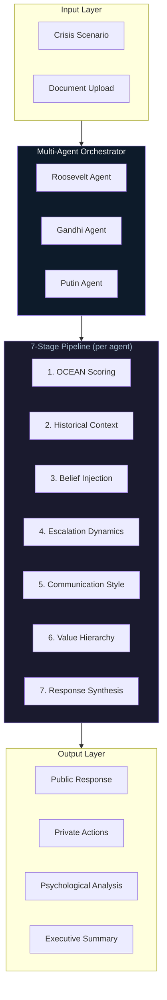
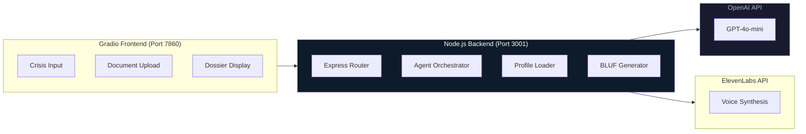

# AdversaryIQ Architecture

## System Overview

AdversaryIQ is a multi-agent psychological intelligence platform that orchestrates three AI personas through a 7-stage decision pipeline to generate crisis responses.

---

## High-Level Flow



---

## 7-Stage Decision Pipeline

Each agent processes crisis scenarios through this deterministic pipeline:

### Stage 1: OCEAN Personality Scoring

Big Five personality traits drive behavioral tendencies:

| Trait | Roosevelt | Gandhi | Putin |
|-------|-----------|--------|-------|
| **Openness** | High | High | Low |
| **Conscientiousness** | High | Very High | High |
| **Extraversion** | Very High | Moderate | Low |
| **Agreeableness** | Low | High | Very Low |
| **Neuroticism** | Low | Low | Moderate |

### Stage 2: Historical Pattern Matching

System loads historical decision-making patterns from JSON profiles:
- Key decisions (Panama Canal, 1971 War, Crimea)
- Crisis response tendencies
- Escalation thresholds

### Stage 3: Belief System Injection

Core beliefs are injected into the prompt context:
- **Roosevelt:** "Speak softly and carry a big stick"
- **Gandhi:** "Non-alignment serves national interest"
- **Putin:** "Russia's sphere of influence must be maintained"

### Stage 4: Escalation Ladder Dynamics

Each response includes escalation phase positioning:

| Phase | Description |
|-------|-------------|
| **Diplomatic** | Verbal posturing, back-channel communication |
| **Economic** | Sanctions, trade restrictions, asset freezes |
| **Military Posturing** | Troop movements, exercises, shows of force |
| **Limited Military** | Targeted strikes, blockades, no-fly zones |
| **Full Engagement** | Open conflict |

### Stage 5: Communication Style

Output is formatted to match historical speech patterns:
- **Roosevelt:** Direct, moralistic, references to national duty
- **Gandhi:** Measured, strategic, emphasizes sovereignty
- **Putin:** Cold, calculated, references to historical grievances

### Stage 6: Value Hierarchy

Priorities that guide decision weighting:

| Agent | Primary Value | Secondary | Tertiary |
|-------|---------------|-----------|----------|
| Roosevelt | National honor | Moral leadership | Strategic advantage |
| Gandhi | National security | Strategic autonomy | Regional stability |
| Putin | Russian dominance | Buffer states | Western containment |

### Stage 7: Response Synthesis

GPT-4o-mini synthesizes all stages into structured output:
- Public response (official statement)
- Private actions (classified operations)
- Psychological reasoning (Big Five analysis)
- Timeline estimate
- Belief impact assessment

---

## System Architecture



---

## API Endpoints

| Endpoint | Method | Purpose |
|----------|--------|---------|
| `/api/health` | GET | System health check |
| `/api/process-crisis` | POST | Analyze crisis through all agents |
| `/api/analyze-document` | POST | Document psychological analysis |
| `/api/synthesize-voice` | POST | Generate voice audio for agent |

### Request: Process Crisis

```json
{
  "crisis": "China announces military exercises around Taiwan"
}
```

### Response: Process Crisis

```json
{
  "scenario": "China announces military exercises around Taiwan",
  "timestamp": "2026-01-07T12:00:00Z",
  "agents": {
    "roosevelt": {
      "name": "Theodore Roosevelt",
      "public_response": "The United States will not stand idly by...",
      "private_actions": "Order 7th Fleet to Taiwan Strait...",
      "psychological_reasoning": "High extraversion drives immediate public response...",
      "escalation_phase": "Military Posturing",
      "timeline": "Immediate",
      "belief_impact": "Reinforces view that strength deters aggression"
    },
    "gandhi": { ... },
    "putin": { ... }
  },
  "overall_risk": "High",
  "key_insights": [
    "All agents recommend measured response",
    "Escalation risk highest from Roosevelt",
    "Gandhi suggests multilateral approach"
  ],
  "bluf": "Multi-agent analysis reveals HIGH risk scenario..."
}
```

---

## Async State Management

Node.js handles concurrent agent processing without race conditions:

```javascript
// Parallel agent processing with Promise.all
const [rooseveltResponse, gandhiResponse, putinResponse] = await Promise.all([
  processScenarioThroughAgent('roosevelt', crisis),
  processScenarioThroughAgent('gandhi', crisis),
  processScenarioThroughAgent('putin', crisis)
]);
```

Key patterns:
- **No shared mutable state** between agent calls
- **Promise.all** for concurrent execution
- **Immutable response objects** prevent cross-contamination
- **Timeout handling** per agent to prevent hanging

---

## Personality Profile Structure

Each agent has two JSON files:

### `*_final_profile.json`
```json
{
  "name": "Theodore Roosevelt",
  "era": "1901-1909",
  "ocean": {
    "openness": 0.75,
    "conscientiousness": 0.85,
    "extraversion": 0.95,
    "agreeableness": 0.35,
    "neuroticism": 0.25
  },
  "key_decisions": [...],
  "communication_style": {...}
}
```

### `*_beliefs.json`
```json
{
  "core_beliefs": [
    "American power should be used for moral good",
    "Military readiness prevents war"
  ],
  "value_hierarchy": ["honor", "duty", "strength"],
  "threat_perception": {...}
}
```

---

## Performance Characteristics

| Metric | Target | Achieved |
|--------|--------|----------|
| Agent response time | <2s | ~1.5s |
| Total pipeline latency | <5s | ~4s |
| Concurrent agent processing | 3 parallel | 3 parallel |
| State consistency | 100% | 100% |

---

## Security Boundaries

| Boundary | Implementation |
|----------|----------------|
| API Keys | Environment variables only |
| User Input | Sanitized before LLM injection |
| Output | Structured JSON prevents injection |
| Voice | Rate-limited to prevent abuse |

---

## Technology Stack

| Component | Technology | Rationale |
|-----------|------------|-----------|
| **LLM** | GPT-4o-mini | Speed/cost optimization for real-time |
| **Backend** | Node.js + Express | Non-blocking I/O for concurrent agents |
| **Frontend** | Gradio | Rapid UI prototyping |
| **Voice** | ElevenLabs | High-quality voice cloning |
| **Profiles** | JSON files | Simple, version-controlled data |
