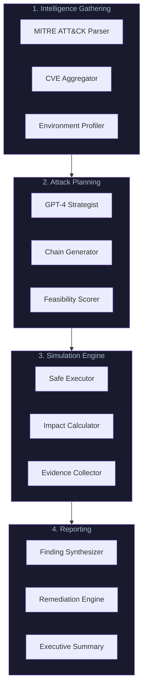
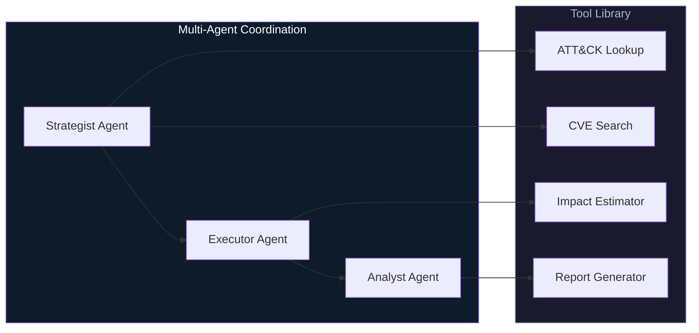

# AdversaryIQ Architecture

## System Overview

AdversaryIQ is a multi-agent system that automates enterprise threat simulation through coordinated AI agents.

---

## High-Level Flow

---

## Core Components

### 1. Intelligence Module

| Component | Function |
|-----------|----------|
| **ATT&CK Parser** | Ingests MITRE framework, builds technique graph |
| **CVE Aggregator** | Monitors NVD, correlates with client tech stack |
| **Environment Profiler** | Maps client infrastructure to attack surface |

### 2. Planning Module

| Component | Function |
|-----------|----------|
| **GPT-4 Strategist** | Generates attack hypotheses based on threat model |
| **Chain Generator** | Builds multi-step attack sequences |
| **Feasibility Scorer** | Ranks attacks by likelihood of success |

### 3. Simulation Module

| Component | Function |
|-----------|----------|
| **Safe Executor** | Runs simulations in isolated environment |
| **Impact Calculator** | Estimates business impact of successful attack |
| **Evidence Collector** | Captures proof-of-concept artifacts |

### 4. Reporting Module

| Component | Function |
|-----------|----------|
| **Finding Synthesizer** | Consolidates results into structured findings |
| **Remediation Engine** | Maps findings to actionable fixes |
| **Executive Summary** | Generates C-level briefing documents |

---

## Agent Architecture

---

## Security Boundaries

| Boundary | Control |
|----------|---------|
| **Simulation Isolation** | All tests run in sandboxed environment |
| **Credential Handling** | No real credentials stored or transmitted |
| **Data Privacy** | Client data never leaves their infrastructure |
| **Audit Logging** | Complete trace of all agent actions |

---

## Technology Stack

| Layer | Technology |
|-------|------------|
| **Agent Core** | GPT-4 with function calling |
| **Orchestration** | Python, LangChain |
| **Backend** | FastAPI, PostgreSQL |
| **Frontend** | React, TypeScript, TailwindCSS |
| **Infrastructure** | Docker, AWS |

---

*This document describes the architecture without revealing proprietary implementation details.*
