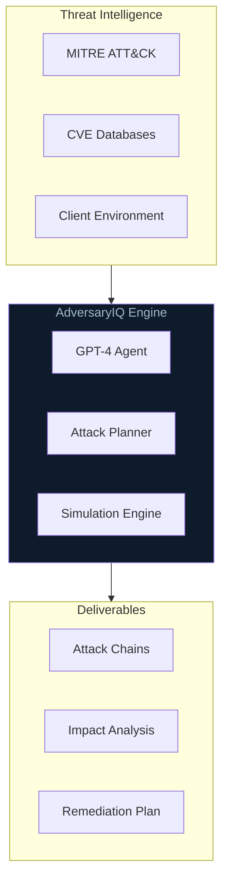

<div align="center">

**Autonomous Red Team Agent for Enterprise Threat Simulation**

[]
[](#demo)


[Architecture](ARCHITECTURE.md)

</div>

---

## Overview

**AdversaryIQ** is an autonomous AI-powered red team agent designed for enterprise threat simulation. The system generates realistic adversarial scenarios, executes multi-step attack chains, and provides actionable remediation guidance.

* **Outcome:** Automated threat simulation reducing manual red team effort by 80%
* **Constraint:** Source code is proprietary and cannot be shared publicly

---

## The Problem

Traditional red team engagements are:
- **Expensive:** Senior security consultants at $300-500/hour
- **Slow:** Weeks of manual testing and report writing
- **Inconsistent:** Quality varies by practitioner expertise

---

## The Solution

AdversaryIQ automates the adversarial thinking process:

```
Threat Intel → Attack Planning → Simulation → Impact Analysis → Remediation
```

| Stage | Capability |
|-------|------------|
| **Reconnaissance** | Automated OSINT gathering and attack surface mapping |
| **Planning** | LLM-powered attack chain generation based on MITRE ATT&CK |
| **Simulation** | Controlled execution of realistic threat scenarios |
| **Reporting** | Automated finding documentation with remediation priorities |

---

## Demo

*Video demonstration coming soon*

---

## High-Level Architecture



See [ARCHITECTURE.md](ARCHITECTURE.md) for detailed system topology.

---

## Key Capabilities

| Capability | Description |
|------------|-------------|
| **Autonomous Planning** | Multi-step attack chain generation without human intervention |
| **MITRE Mapping** | All scenarios mapped to ATT&CK techniques for compliance |
| **Risk Scoring** | Quantified impact assessment with CVSS-like scoring |
| **Safe Simulation** | Controlled execution that never touches production systems |

---

## Technical Stack

- **Agent Core:** GPT-4 with custom system prompts and tool use
- **Backend:** Python, FastAPI
- **Frontend:** React, TypeScript
- **Data:** MITRE ATT&CK, NVD, custom threat intelligence

---

## Access

This project contains proprietary intellectual property and is not available as open source.

For inquiries about AdversaryIQ capabilities or partnership opportunities:

<p align="center">
  <a href="mailto:gregory.e.schwartz@gmail.com"></a>
  <a href="https://linkedin.com/in/gregory-e-schwartz"></a>
</p>

---

## Author

**Gregory E. Schwartz**
- M.S. Artificial Intelligence (Yeshiva University)
- MBA (Cornell University)

---


