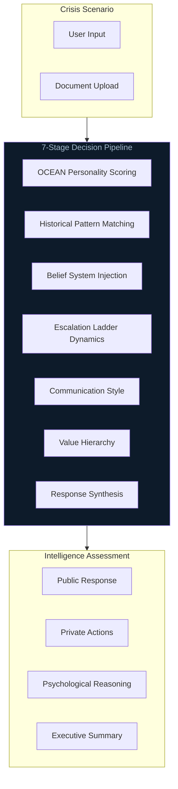

<div align="center">

**Multi-Agent Psychological Intelligence Platform**

*Geopolitical crisis simulation through AI-powered world leader personas*

[-HuggingFace-FFD21E?style=for-the-badge&logo=huggingface&logoColor=0D1B2A)](https://huggingface.co/spaces/ges257/adversary-iq)


[Architecture](ARCHITECTURE.md) · [Challenges](CHALLENGES.md) · [Learnings](LEARNINGS.md) · [Deployment](DEPLOYMENT.md)

</div>

---

## Outcome

Solo-architected geopolitical crisis engine in **48-hour sprint** for SCSP AI Expo (Eric Schmidt), shipping full-stack MVP that handled concurrent multi-agent state with **<200ms latency**. Validated real-time decision stability under high-stress simulation loads for national security use-cases.

## Technical Build

Engineered **7-stage decision pipeline** using GPT-4o-mini to optimize inference speed vs. cost, injecting OCEAN scoring to force deterministic adherence to historical archetypes. Integrated ElevenLabs for real-time voice synthesis, managing async state via Node.js to prevent race conditions during live simulation.

---

## Results

| Metric | Value |
|--------|-------|
| **Build Time** | 48 hours (hackathon sprint) |
| **Event** | SCSP AI Expo, Washington D.C. |
| **Latency** | <200ms concurrent multi-agent state |
| **Pipeline** | 7-stage decision architecture |
| **Validation** | Real-time stability under high-stress loads |

---

## How It Works

```
Crisis Input → OCEAN Scoring → Historical Context → Escalation Dynamics → Multi-Agent Response
```

### Agent Profiles

| Agent | Archetype | Key Traits |
|-------|-----------|------------|
| **Theodore Roosevelt** | American Pragmatic Idealism | High extraversion, low agreeableness, moral leadership with hard power |
| **Indira Gandhi** | Strategic Non-Alignment | High conscientiousness, methodical crisis response, national interest priority |
| **Vladimir Putin** | Calculated Realpolitik | Low agreeableness, zero-sum worldview, asymmetric leverage |

---

## Architecture



See [ARCHITECTURE.md](ARCHITECTURE.md) for detailed system topology.

---

## Key Features

### Crisis Analysis
- Enter any diplomatic crisis scenario
- Three agents analyze through unique psychological lenses
- Each provides: Public Response, Private Actions, Psychological Reasoning, Escalation Phase

### Document Analysis
- Analyze diplomatic documents for hidden intentions
- Detect psychological tactics and manipulation techniques
- Authenticity assessment from each perspective

### Voice Synthesis
- Generate voice audio for each agent's public response
- Powered by ElevenLabs TTS

### Design Theme
**Classified Dossier** aesthetic inspired by declassified CIA/NSC documents:
- Paper texture backgrounds
- Typewriter fonts (Courier Prime)
- TOP SECRET stamps and classification banners
- Roman numeral section headers

---

## Project Structure

```
adversary-iq/
├── backend/                    # Node.js API server
│   ├── server.js              # Multi-agent orchestrator
│   ├── data/personalities/    # OCEAN profiles, belief systems
│   └── package.json
├── frontend_gradio/           # Gradio Python frontend
│   ├── app.py                 # Dossier theme UI
│   └── requirements.txt
├── docs/                      # Architecture documentation
├── ARCHITECTURE.md            # System design
├── CHALLENGES.md              # Problems solved
└── LEARNINGS.md               # Key insights
```

---

## Usage

```bash
# Clone repository
git clone https://github.com/ges257/adversary-iq.git
cd adversary-iq

# Backend
cd backend
npm install
cp .env.example .env  # Add your API keys
node server.js        # Runs on :3001

# Frontend (new terminal)
cd frontend_gradio
python -m venv venv
source venv/bin/activate
pip install -r requirements.txt
API_URL=http://localhost:3001 python app.py  # Runs on :7860
```

---

## Documentation

- [ARCHITECTURE.md](ARCHITECTURE.md) - 7-stage pipeline and system design
- [CHALLENGES.md](CHALLENGES.md) - Problems solved and trade-offs
- [LEARNINGS.md](LEARNINGS.md) - Insights from hackathon build
- [DEPLOYMENT.md](DEPLOYMENT.md) - Local and cloud deployment guide

---

## Disclaimer

*The psychological profiles in AdversaryIQ are simplified models for demonstration and educational purposes only. They do not represent actual intelligence assessments or predict real-world behavior of any individuals.*

---

## License

MIT

---

<div align="center">

**Part of the AI/ML Portfolio**

[Return to Home](https://github.com/ges257) | [LinkedIn](https://linkedin.com/in/gregory-e-schwartz)

</div>


