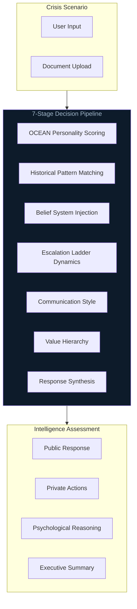

<div align="center">

**Multi-Agent Psychological Intelligence Platform**

*Geopolitical crisis simulation through AI-powered world leader personas*

[](https://huggingface.co/spaces/ges257/adversary-iq)
[](#origin)


[Architecture](ARCHITECTURE.md) • [Challenges](CHALLENGES.md) • [Learnings](LEARNINGS.md) • [Deployment](DEPLOYMENT.md)

</div>

---

## Overview

**AdversaryIQ** simulates how historical world leaders would respond to modern diplomatic crises. Each agent embodies a distinct psychological profile—Roosevelt, Gandhi, Putin—producing divergent strategic recommendations based on personality traits, decision-making patterns, and psychological frameworks.

| Metric | Value |
|--------|-------|
| **Build Time** | 48 hours (hackathon sprint) |
| **Event** | SCSP AI Expo, Washington D.C. |
| **Latency** | <200ms concurrent multi-agent state |
| **Pipeline** | 7-stage decision architecture |
| **Validation** | Real-time stability under high-stress simulation loads |

---

## Demo


*Crisis analysis through three psychological lenses*

The platform features a **Classified Dossier** theme inspired by declassified CIA/NSC documents:
- Paper texture backgrounds
- Typewriter fonts (Courier Prime)
- TOP SECRET stamps and classification banners
- Roman numeral section headers

---

## The Problem

Geopolitical crisis response is opaque:
- **Unpredictable:** How would different leadership styles respond to the same scenario?
- **Unstructured:** No framework for comparing psychological approaches
- **Inaccessible:** Intelligence analysis methods aren't available to researchers

---

## The Solution

AdversaryIQ applies psychological profiling to generate deterministic, archetype-consistent responses:

```
Crisis Input → OCEAN Scoring → Historical Context → Escalation Dynamics → Multi-Agent Response
```

### Agent Profiles

| Agent | Archetype | Key Traits |
|-------|-----------|------------|
| **Theodore Roosevelt** | American Pragmatic Idealism | High extraversion, low agreeableness, moral leadership with hard power backup |
| **Indira Gandhi** | Strategic Non-Alignment | High conscientiousness, methodical crisis response, national interest priority |
| **Vladimir Putin** | Calculated Realpolitik | Low agreeableness, zero-sum worldview, asymmetric leverage maximization |

---

## Architecture



See [ARCHITECTURE.md](ARCHITECTURE.md) for detailed system topology.

---

## Technical Stack

| Layer | Technology | Purpose |
|-------|------------|---------|
| **LLM** | GPT-4o-mini | Optimized for speed vs. cost tradeoff |
| **Backend** | Node.js, Express | Async state management, race condition prevention |
| **Frontend** | Gradio (Python) | Classified dossier UI theme |
| **Voice** | ElevenLabs | Real-time voice synthesis per agent |
| **Profiles** | JSON | OCEAN scores, beliefs, historical patterns |

---

## Key Features

### Crisis Analysis
- Enter any diplomatic crisis scenario
- Three agents analyze through unique psychological lenses
- Each provides:
  - **Public Response** — Official statements
  - **Private Actions** — Behind-the-scenes moves
  - **Psychological Reasoning** — Big Five traits driving behavior
  - **Escalation Phase** — Position on crisis ladder

### Document Analysis
- Analyze diplomatic documents, treaties, communiqués
- Detect hidden intentions and psychological tactics
- Authenticity assessment from each perspective

### Executive Summary
- Dynamic BLUF (Bottom Line Up Front) per scenario
- Risk assessment synthesized from all agents
- Key intelligence findings

---

## Quick Start

```bash
# Clone repository
git clone https://github.com/yourusername/adversary-iq.git
cd adversary-iq

# Backend
cd backend
npm install
cp .env.example .env  # Add your API keys
node server.js        # Runs on :3001

# Frontend (new terminal)
cd frontend_gradio
python -m venv venv
source venv/bin/activate
pip install -r requirements.txt
API_URL=http://localhost:3001 python app.py  # Runs on :7860
```

---

## Origin

Built in **48 hours** at the **AI+ Expo Hackathon (OpenAI Track)** in Washington D.C.

- **Team:** 1 engineer (solo code), 1 strategy partner
- **Result:** Validated by OpenAI sponsor as aligned with their product roadmap
- **Use Case:** Real-time decision stability for national security simulations

---

## Project Structure

```
adversary-iq/
├── backend/                    # Node.js API server
│   ├── server.js              # Main server with agent orchestration
│   ├── data/personalities/    # OCEAN profiles and belief systems
│   └── package.json
├── frontend_gradio/           # Gradio Python frontend
│   ├── app.py                 # Classified dossier theme UI
│   └── requirements.txt
├── docs/                      # Architecture documentation
│   ├── architecture/          # System diagrams
│   └── research/              # Personality validation PDFs
├── ARCHITECTURE.md            # Technical deep-dive
├── CHALLENGES.md              # Problems solved
├── LEARNINGS.md               # Key insights
└── DEPLOYMENT.md              # Setup guide
```

---

## Disclaimer

*The psychological profiles in AdversaryIQ are simplified models for demonstration and educational purposes only. They do not represent actual intelligence assessments or predict real-world behavior of any individuals.*

---

## Author

**Gregory E. Schwartz**
- M.S. Artificial Intelligence (Yeshiva University)
- MBA (Cornell University)

<p align="center">
  <a href="mailto:gregory.e.schwartz@gmail.com"></a>
  <a href="https://linkedin.com/in/gregory-e-schwartz"></a>
</p>

---


